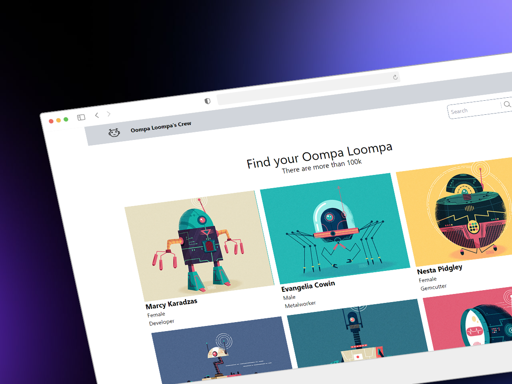

## Oompa Loompa's Management Tool
(Project guidelines at the end)

  
This project provides a tool for managing your Oompa Loompa workforce.
  
### Getting Started
1.  **Clone the Repository:**

```
git clone https://github.com/amaimus/napptilus-test.git
```
2.  **Navigate to the Project Directory:**

```
cd napptilus-test
```
3.  **Install Dependencies and Start Development Server:**

This command will install the project's dependencies and launch the development server.
```
npm install && npm run dev

```

4.  **Access the Application:**

Once the server starts, you will see a message in your terminal with a link to the application. It should look something like `http://localhost:5173/`. Open this link in your web browser to access the Oompa Loompa Management Tool.


**About the Tool** (Project guidelines)

1. ✅ List Oompa Loompas
2. ✅ Save Oompa Loompas information in the store
3. 🟥 Check if the information already exists in the store before consulting the API
4. ✅ Show detailed view of the Oompa Loompa when clicking
5. ✅ When accessing the detailed view, the API is consulted for additional information
6. ✅ The HTML tags in the description of the Oompa Loompas are interpreted
7. 🟥 The additional information is stored to avoid repeating queries to the API
8. 🟥 Check if a day has passed since the information was obtained to update it
9. ✅ The information can be filtered by name, surname and profession locally
10. ✅ The navigation is done always client-side, without completely refreshing the whole document.
11. ✅ The base path of the project must be '/' and the detail path '/:id'
12. ✅ The views layout should stick to the designs shown in their respective view description
13. 🟥 Implement an Endless Scroll
14. ✅ Implement an alternative to paginate with buttons if the infinite scroll cannot be done
15. ✅ Clicking on the header should redirect to the main view
